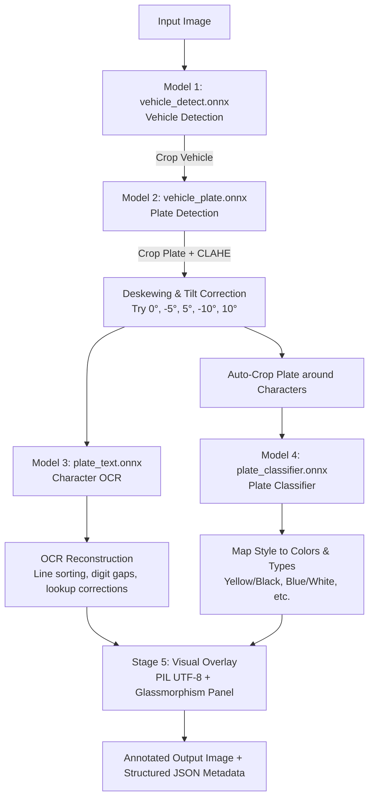

# Lao License Plate OCR & Color Classification Logic & Workflow

This document explains the logic, workflow, and individual AI models of the Lao License Plate OCR & Color Classification system located in this directory.

---

## 1. High-Level System Architecture

The core AI engine is a multi-stage hierarchical pipeline. Instead of running a single heavy model that does everything, it uses **four distinct neural networks (YOLO models)** sequentially. Each model is specialized for a single task:

---

## 2. The 4 Neural Network Models (Inside [models/](file:///c:/Users/billi/Desktop/laolicenceplate/AI/models))

### Model 1: Vehicle Detector (`vehicle_detect.onnx`)
* **Role**: Detects vehicles (cars, buses, trucks) in the input image.
* **Why**: Plates are small relative to an entire street camera image. Searching for a license plate directly on the full image leads to high false positives and missed detections. Restricting the search to a vehicle crop dramatically increases detection accuracy.
* **Details**: A standard pre-trained YOLOv8 Nano model on the COCO dataset, filtering classes `2` (car), `5` (bus), and `7` (truck) defined in [config.py](file:///c:/Users/billi/Desktop/laolicenceplate/AI/src/config.py).

### Model 2: Plate Detector (`vehicle_plate.onnx`)
* **Role**: Locates the boundaries of the license plate inside each cropped vehicle image.
* **Why**: High-precision boundary detection.
* **Details**: Custom-trained YOLOv8 detection model. It has two modes:
  1. **Primary**: High-confidence threshold check (`conf=0.18`) inside the vehicle crop.
  2. **Secondary/Fallback**: Low-confidence retry (`conf=0.10`) inside the vehicle crop if the primary check misses. If absolutely no vehicle is found, it falls back to scanning the entire image.

### Model 3: Character OCR (`plate_text.onnx`)
* **Role**: Detects individual letters, digits, and province abbreviation codes on the plate panel.
* **Why**: Standard OCR engines (like Tesseract) perform poorly on custom Lao plates due to unique layouts, non-standard fonts, and two-line structures. Running a custom YOLOv8 character detector on character bounding boxes ensures high precision.
* **Details**: A character detection model containing classes for alphanumeric characters (`A`-`Z`, `0`-`9`) and province codes (e.g. `VTE`, `SVK`, `LPB`).

### Model 4: Plate Classifier (`plate_classifier.onnx`)
* **Role**: Classifies the plate's type/style from the crop.
* **Why**: In Lao PDR, plate background and text colors identify the vehicle's registry type (e.g., Private, Government, Business, Foreign). It classifies the plate style into one of seven classes:
  * `private` (Private License Plate)
  * `government` (Government License Plate)
  * `business_100` (Business License Plate - 100%)
  * `business_1` (Business License Plate - 1%)
  * `military_police` (Military/Police License Plate)
  * `foreign` (Foreign License Plate)
  * `international_organization` (International Organization Plate)
* **Details**: A YOLOv8 image classification network trained on tightly cropped plate images.

---

## 3. End-to-End Execution Logic & Algorithms

The pipeline logic is governed by [pipeline.py](file:///c:/Users/billi/Desktop/laolicenceplate/AI/src/pipeline.py), utilizing helper functions in [ocr_utils.py](file:///c:/Users/billi/Desktop/laolicenceplate/AI/src/ocr_utils.py) and [visual_utils.py](file:///c:/Users/billi/Desktop/laolicenceplate/AI/src/visual_utils.py).

### Stage 1: Vehicle & Plate Localization
1. **Vehicle Crop**: The system detects vehicles using **Model 1**.
2. **Plate Crop**: Inside each vehicle crop, **Model 2** detects the plate. A padding of 5px (`PLATE_INITIAL_PADDING`) is added around the plate box to ensure no character is clipped.
3. **IoU Non-Maximum Suppression**: If multiple bounding boxes overlap on the same physical plate, the system runs an IoU (Intersection over Union) filter to keep only the highest confidence detection.

### Stage 2: Deskewing & Image Enhancement
1. **CLAHE Normalization**: Contrast Limited Adaptive Histogram Equalization is applied to the plate crop to equalize illumination and make text details pop.
2. **Multi-Angle Rotation Loop**: License plates on vehicles are often tilted. The system tests multiple rotation angles `[0, -5, 5, -10, 10]` degrees.
   - For each angle, **Model 3** detects character bounding boxes.
   - A score is calculated: $\text{Score} = (\text{Number of characters detected} \times 10) + \text{Sum of character confidences}$.
   - The angle producing the highest score is chosen.
   - **Early-Exit Optimization**: If the default `0°` angle yields 6+ characters with an average confidence $\ge 82\%$, the rotation loop is skipped entirely to save compute power.

### Stage 3: OCR Text Reconstruction (Smart Post-Processing)
Once the character bounding boxes are detected, the system applies heavy structural logic to reconstruct the plate text:
1. **Spatial Grouping (Lines)**: Characters are sorted by their X coordinates and grouped into lines based on vertical overlap. Usually, Lao plates are split into two lines: Province code (e.g. `VTE`) on the top/bottom line, and letters + digits (e.g., `ກຂ 1234`) on another.
2. **Province Translation**: Abbreviation codes detected are converted to Lao and English names via `LAO_PROVINCE_MAP` in [config.py](file:///c:/Users/billi/Desktop/laolicenceplate/AI/src/config.py) (e.g. `VTE` $\rightarrow$ `ນະຄອນຫຼວງວຽງຈັນ (Vientiane)`).
3. **Context Correction (Letter vs. Digit Zones)**: 
   - A penalty algorithm determines where the transition from letters (prefix) to digits (numbers) happens.
   - Inside the **Letter Zone**, lookalike digits are corrected to letters (e.g., `0` $\rightarrow$ `O`, `1` $\rightarrow$ `I`, `8` $\rightarrow$ `B`).
   - Inside the **Digit Zone**, lookalike letters are corrected to digits (e.g., `O` $\rightarrow$ `0`, `I` $\rightarrow$ `1`, `S` $\rightarrow$ `5`).
4. **Gap Filling**: If a digit is missing or obscured, the algorithm computes average character widths and inserts a placeholder `?` in the gap, maintaining the standard 4-digit layout representation.
5. **Lao Script Mapping**: Detected English letters are translated into Lao characters via `LAO_LETTER_MAP` (e.g. `A` $\rightarrow$ `ກ`, `B` $\rightarrow$ `ຂ`).

### Stage 4: Plate Type & Color Classification
1. **Auto-Cropping**: The plate is tightly cropped around the union of its character bounding boxes (discarding outer frames, brackets, or car bumper colors).
2. **Classification**: The tightly cropped plate is sent to **Model 4** to identify the style.
3. **Color Translation**: The style maps directly to background and text colors:
    * `private` $\rightarrow$ **Yellow** background / **Black** text
    * `government` $\rightarrow$ **Blue** background / **White** text
    * `military_police` $\rightarrow$ **Red** background / **White** text
    * `business_100` $\rightarrow$ **White** background / **Black** text
    * `business_1` $\rightarrow$ **White** background / **Blue** text
    * `foreign` $\rightarrow$ **Yellow** background / **Blue** text
    * `international_organization` $\rightarrow$ **White** background / **Blue** text

### Stage 5: Stylish Visualization Overlay
The final output frame has an overlay drawn over it:
* It reads the plate box and draws a bounding box matching the color of the plate.
* Above or below the plate, a **glassmorphism-style translucent panel** is rendered with a dark background and the plate colors' border.
* Standard OpenCV doesn't support rendering non-ASCII Unicode (like Lao script). The visualizer uses Python's **Pillow** library to render Lao fonts (`saysettha.ttf`, `dokchampa.ttf`, or `LaoUI.ttf`) onto the image, falling back to basic ASCII standard OpenCV text if those fonts aren't available.
