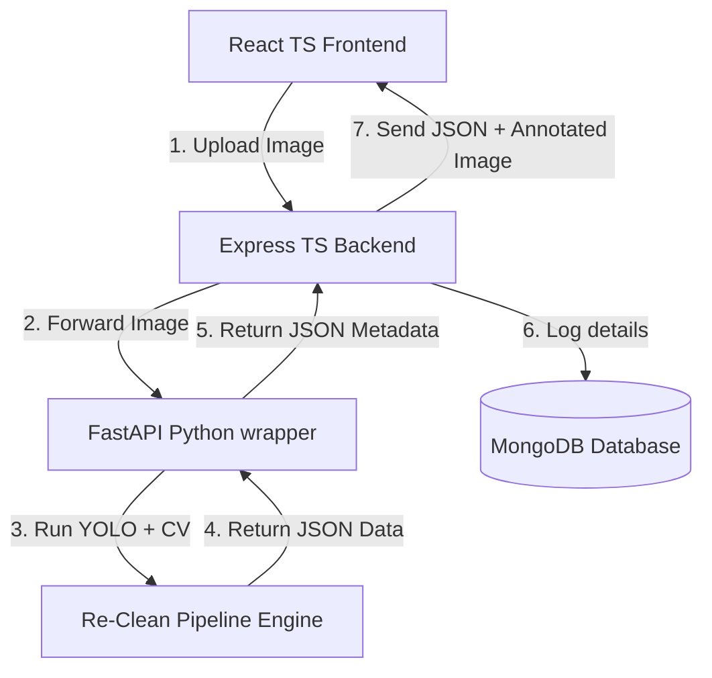

# Lao License Plate OCR & Color Classification Workflow

This guide details the folder structure, installation steps, Git configuration, and next-step architecture blueprints to integrate this Python core with a full-stack web application (React TS + Express TS + MongoDB).

---

## 1. Directory Structure & Component Workflow

The modular layout under `AI/` isolates config, logic, models, and execution into clean compartments:

```
AI/
├── models/
│   ├── vehicle_plate.pt        # YOLOv8 weights for finding plates
│   └── plate_text.pt           # YOLOv8 weights for character reading
├── src/
│   ├── __init__.py             # Package initialization
│   ├── config.py               # Constants, translations, and color rules
│   ├── ocr_utils.py            # OCR line grouping, correction, & deskewing
│   ├── color_utils.py          # HSV background & text stroke color analyser
│   ├── visual_utils.py         # Pillow text rendering & overlay drawer
│   └── pipeline.py             # Reusable unified processing class
├── main.py                     # CLI entrypoint runner
├── requirements.txt            # Package dependencies list
└── .gitignore                  # Git untracked files lists
```

### How They Work Together:

1. `main.py` instantiates `LicensePlatePipeline` from `src/pipeline.py`.
2. The pipeline loads model paths from `src/config.py`.
3. An input image is read via OpenCV.
4. **Stage 1 (Plate Bounding Box)**: `plate_model` detects plate locations.
5. **Stage 2 (Deskew & Characters)**: For each crop, `ocr_utils` rotates the crop to find the best angle and runs `text_model` to locate characters.
6. **Stage 3 (OCR Text Reconstruction)**: Character boxes are sorted, grouped into text lines, corrected for context, and mapped to province names.
7. **Stage 4 (Color and Type Classification)**: `color_utils` extracts background and font colors to determine the plate type.
8. **Stage 5 (Overlay Drawing)**: `visual_utils` draws coordinates and card details on the frame.
9. Structured list data and the final frame are returned.

---

## 2. Installation & Running Locally

### Step 1: Initialize Virtual Environment

Create a self-contained Python virtual environment inside `AI`:

```powershell
python -m venv .venv
```

### Step 2: Install Required Packages

Activate the environment and install dependencies listed in `requirements.txt`:

```powershell
# Windows PowerShell
.venv\Scripts\Activate.ps1
pip install -r requirements.txt

# Linux / macOS
source .venv/bin/activate
pip install -r requirements.txt
```

### Step 3: Run the Pipeline

Run the script to process files in `test_images/`:

```powershell
python main.py
```

---

## 3. Gitignore Requirements

To keep your Git repository clean and lightweight, you must prevent committing virtual environments, large binary weight files, and temporary outputs.

Create a `.gitignore` inside the root of your project:

```
# Python local environments
.venv/
env/
venv/
ENV/

# Python compiled caching files
**/__pycache__/
*.pyc

# Local runtime directories & outputs
runs/color_ocr_results/
runs/detect/
.idea/
.vscode/

# Large model weights (Optional - if you store weights elsewhere or use CDN)
# Re-Clean/models/*.pt
```

---

## 4. Full-Stack Integration Architecture (React TS + Express TS + MongoDB)

To build a web app around this core, we recommend wrapping the Python engine in a lightweight API (using FastAPI/Flask) that is called by your Express server.

### System Architecture Flow



---

### Step A: Wrap Python Pipeline in FastAPI (Python API)

Create a quick FastAPI wrapper script (e.g. `api.py` inside `Re-Clean/`):

```python
# Re-Clean/api.py
from fastapi import FastAPI, UploadFile, File
from src.pipeline import LicensePlatePipeline
import numpy as np
import cv2

app = FastAPI()
pipeline = LicensePlatePipeline()

@app.post("/api/v1/scan")
async def scan_plate(file: UploadFile = File(...)):
    # Read uploaded file bytes into OpenCV BGR
    contents = await file.read()
    nparr = np.frombuffer(contents, np.uint8)
    img = cv2.imdecode(nparr, cv2.IMREAD_COLOR)

    # Process
    results, _ = pipeline.process_image(img)

    # Returns structured JSON metadata
    return {"status": "success", "detections": results}
```

_Run it using: `uvicorn api:app --host 0.0.0.0 --port 8000`_

---

### Step B: Database Schema (Mongoose + MongoDB)

Create a database model to log plate reads inside your Express server:

```typescript
// backend/src/models/PlateLog.ts
import { Schema, model, Document } from "mongoose";

export interface IPlateLog extends Document {
  timestamp: Date;
  ocrEn: string;
  ocrLao: string;
  bg_color: string;
  font_color: string;
  plate_type: string;
  confidence: number;
}

const PlateLogSchema = new Schema<IPlateLog>({
  timestamp: { type: Date, default: Date.now },
  ocrEn: { type: String, required: true },
  ocrLao: { type: String, required: true },
  bg_color: { type: String, required: true },
  font_color: { type: String, required: true },
  plate_type: { type: String, required: true },
  confidence: { type: Number, required: true },
});

export const PlateLog = model<IPlateLog>("PlateLog", PlateLogSchema);
```

---

### Step C: Express TypeScript Backend Endpoint

Your Express API will receive the image from the user, forward it to the Python API, store the metadata in MongoDB, and send the result back to the user.

```typescript
// backend/src/routes/plate.route.ts
import { Router, Request, Response } from "express";
import multer from "multer";
import axios from "axios";
import FormData from "form-data";
import { PlateLog } from "../models/PlateLog";

const router = Router();
const upload = multer({ limits: { fileSize: 5 * 1024 * 1024 } }); // 5MB limit

router.post(
  "/upload",
  upload.single("image"),
  async (req: Request, res: Response) => {
    try {
      if (!req.file) {
        return res.status(400).json({ error: "No image uploaded" });
      }

      // 1. Prepare Form Data to send to Python FastAPI microservice
      const formData = new FormData();
      formData.append("file", req.file.buffer, req.file.originalname);

      // 2. Call Python FastAPI Wrapper Service
      const pythonResponse = await axios.post(
        "http://localhost:8000/api/v1/scan",
        formData,
        {
          headers: formData.getHeaders(),
        },
      );

      const detections = pythonResponse.data.detections;

      // 3. Log results to MongoDB
      const savedLogs = [];
      for (const detection of detections) {
        const log = new PlateLog({
          ocrEn: detection.ocr_en,
          ocrLao: detection.ocr_lao,
          bg_color: detection.bg_color,
          font_color: detection.font_color,
          plate_type: detection.plate_type,
          confidence: detection.confidence,
        });
        await log.save();
        savedLogs.push(log);
      }

      // 4. Return logged objects and detection results back to Frontend
      return res.status(200).json({
        success: true,
        data: detections,
        db_logs: savedLogs,
      });
    } catch (error: any) {
      console.error("Error scanning license plate:", error.message);
      return res
        .status(500)
        .json({ error: "Internal Server Error during plate recognition" });
    }
  },
);

export default router;
```

---

### Step D: React TypeScript Frontend Component Example

A simple frontend dropzone file uploader that sends the image to Express and displays the JSON-structured plate metadata:

```typescript
// frontend/src/components/PlateUploader.tsx
import React, { useState } from 'react';
import axios from 'axios';

interface Detection {
  ocr_en: string;
  ocr_lao: string;
  bg_color: string;
  font_color: string;
  plate_type: string;
  confidence: number;
}

export const PlateUploader: React.FC = () => {
  const [file, setFile] = useState<File | null>(null);
  const [results, setResults] = useState<Detection[]>([]);
  const [loading, setLoading] = useState(false);

  const handleUpload = async () => {
    if (!file) return;
    setLoading(true);
    const formData = new FormData();
    formData.append('image', file);

    try {
      const response = await axios.post('/api/upload', formData);
      setResults(response.data.data);
    } catch (err) {
      console.error('Upload failed', err);
    } finally {
      setLoading(false);
    }
  };

  return (
    <div style={{ padding: '20px', fontFamily: 'sans-serif' }}>
      <h2>Lao License Plate Recognizer</h2>
      <input type="file" onChange={(e) => setFile(e.target.files?.[0] || null)} />
      <button onClick={handleUpload} disabled={loading || !file}>
        {loading ? 'Analyzing...' : 'Scan Plate'}
      </button>

      <div style={{ marginTop: '20px' }}>
        {results.map((plate, index) => (
          <div key={index} style={{ border: '1px solid #ccc', padding: '10px', margin: '10px 0', borderRadius: '5px' }}>
            <p><strong>Plate Type:</strong> {plate.plate_type}</p>
            <p><strong>Colors:</strong> Background: {plate.bg_color} | Letters: {plate.font_color}</p>
            <p><strong>OCR English:</strong> {plate.ocr_en}</p>
            <p><strong>OCR Lao:</strong> {plate.ocr_lao}</p>
            <p><strong>Confidence:</strong> {(plate.confidence * 100).toFixed(1)}%</p>
          </div>
        ))}
      </div>
    </div>
  );
};
```
