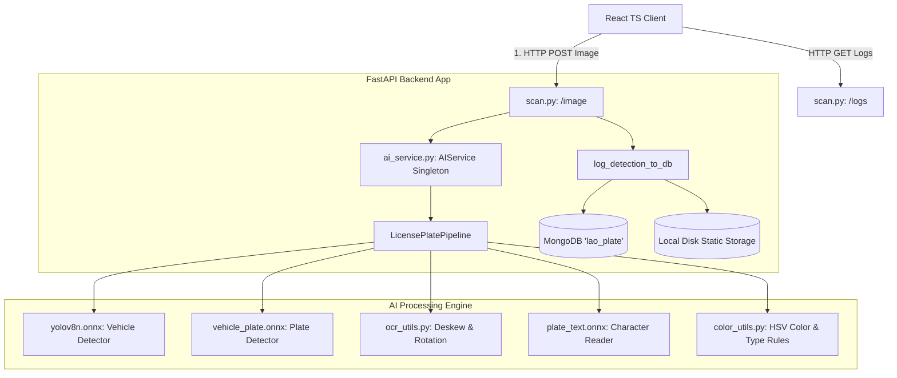

# Lao License Plate Recognition System: Architecture & Workflow Guide

This document describes the high-level system architecture, database schema, component boundaries, and step-by-step logical workflow of the application. It is designed to help new developers understand the codebase and integration flows quickly.

---

## 1. System Architecture Overview

The system is split into three main layers: **React Frontend**, **FastAPI Backend**, and the **AI Processing Pipeline** running ONNX models with GPU (DirectML) acceleration. Detections and audit images are persisted in **MongoDB** and local static directories.



---

## 2. Step-by-Step AI Core Detection Logic

When an image is passed to `LicensePlatePipeline.process_image(img)` inside `AI/src/pipeline.py`, it executes a cascaded hierarchical flow:

```
[Input Frame]
      │
      ▼
┌───────────┐
│  Stage 1  │ Detect Vehicles (yolov8n.onnx - classes: 2:Car, 5:Bus, 7:Truck)
└─────┬─────┘
      │ (Crop each vehicle region)
      ▼
┌───────────┐
│  Stage 2  │ Scan for License Plate inside each vehicle crop (vehicle_plate.onnx)
└─────┬─────┘ * If no vehicles are found, falls back to scan full image.
      │
      ▼
┌───────────┐
│  Stage 3  │ Deskewing & OCR: Run rotation correction loop (ocr_utils.py)
└─────┬─────┘ * Tries 0 degrees first (early-exit if confidence is high).
      │ * Uses plate_text.onnx to find characters.
      ▼
┌───────────┐
│  Stage 4  │ Heuristics & Correction:
└─────┬─────┘ * Reconstruct lines, map characters (letters vs digits context).
      │ * Translate symbols into full Lao Province names (e.g. VTE -> Vientiane).
      ▼
┌───────────┐
│  Stage 5  │ HSV Color Classification (color_utils.py):
└─────┬─────┘ * Extracts median background color and dominant character stroke color.
      │ * Matches colors against mapping rules to determine Plate Type (Private, State, etc.)
      ▼
┌───────────┐
│  Stage 6  │ Bounding Box Translation:
└─────┬─────┘ * Transforms the local plate coordinates back to original image space.
      │ * Draws bounding boxes (Vehicle & Plate) and information cards on frame.
      ▼
[Outputs: Results Array + Annotated BGR Frame]
```

---

## 3. Data Flow & Integration (AI ➔ Backend ➔ DB ➔ Frontend)

### Phase 1: Upload & Inference
1.  **Frontend Upload:** The user selects an image and clicks **Scan License Plate** in the React app. The client issues a `multipart/form-data` HTTP POST request containing the image file to the backend: `/api/v1/scan/image`.
2.  **API Handler:** The backend router `scan.py` decodes the image bytes into an OpenCV BGR numpy array (`cv2.imdecode`) and calls the singleton `AIService` pipeline: `pipeline.process_image(img)`.
3.  **Inference:** The AI pipeline runs vehicle and plate detection (using DirectML GPU acceleration), performs OCR, draws the visual overlays, and returns:
    *   An array of detection dictionaries (containing coordinates, cropped images, text values, and colors).
    *   The fully annotated output image.

### Phase 2: Logging & Persistence
4.  **Local Storage:** The backend takes the cropped license plate and vehicle numpy arrays out of the results array. It saves them locally to their respective static directories:
    *   `backend/static/plates/{id}.jpg`
    *   `backend/static/vehicles/{id}.jpg`
5.  **Database Storage:** A new document is written to the MongoDB `plate_logs` collection. The relative access URLs (e.g. `/static/vehicles/{id}.jpg`) are recorded alongside the OCR text, confidence scores, and plate type.
6.  **Response:** The API server converts the annotated image into a base64 string and sends the final JSON payload containing the metadata list and base64 image back to the frontend.

### Phase 3: Frontend Render
7.  **Scan Render:** The frontend UI renders the full annotated image alongside a detailed list. For each plate found, it shows the OCR values, plate type, and displays side-by-side cropped images of the vehicle and license plate.
8.  **Database History Render:** When a user navigates to the **Plate Database** tab, the frontend requests `GET /api/v1/scan/logs`. The backend returns the latest records from MongoDB, and the frontend dynamically displays them in dashboard cards showing both the vehicle and plate crops.

---

## 4. Database Schema (MongoDB `plate_logs`)

Each logged license plate record in MongoDB follows this structured schema:

```json
{
  "_id": ObjectId("6a32d385b736b71dd10aa4b3"),
  "timestamp": 1781883845.123,
  "ocr_en": "VTE | A A 8 6 7 7",
  "ocr_lao": "ນະຄອນຫຼວງວຽງຈັນ (Vientiane) | ກ ກ 8 6 7 7",
  "bg_color": "White",
  "font_color": "Black",
  "plate_type": "Business License Plate (100%)",
  "confidence": 0.77,
  "image_url": "/static/plates/6a32d385b736b71dd10aa4b3.jpg",
  "vehicle_image_url": "/static/vehicles/6a32d385b736b71dd10aa4b3.jpg"
}
```

---

## 5. Summary of Main Code Files

*   **[main.py (AI)](file:///c:/Users/billi/Desktop/laolicenceplate/AI/main.py):** CLI script to process local files in `test_images/`.
*   **[pipeline.py (AI)](file:///c:/Users/billi/Desktop/laolicenceplate/AI/src/pipeline.py):** The master orchestration pipeline.
*   **[ocr_utils.py (AI)](file:///c:/Users/billi/Desktop/laolicenceplate/AI/src/ocr_utils.py):** Logic for deskewing/rotation, character correction, line grouping, and province matching.
*   **[color_utils.py (AI)](file:///c:/Users/billi/Desktop/laolicenceplate/AI/src/color_utils.py):** HSV color thresholds and plate type classification.
*   **[scan.py (Backend)](file:///c:/Users/billi/Desktop/laolicenceplate/backend/app/routers/scan.py):** API routes for `/image`, `/logs`, and video processing.
*   **[ImageScanner.tsx (Frontend)](file:///c:/Users/billi/Desktop/laolicenceplate/frontend/src/components/ImageScanner.tsx):** Web page displaying upload boxes and side-by-side crop scans.
*   **[PlateDatabase.tsx (Frontend)](file:///c:/Users/billi/Desktop/laolicenceplate/frontend/src/components/PlateDatabase.tsx):** History dashboard showing recent scans.
