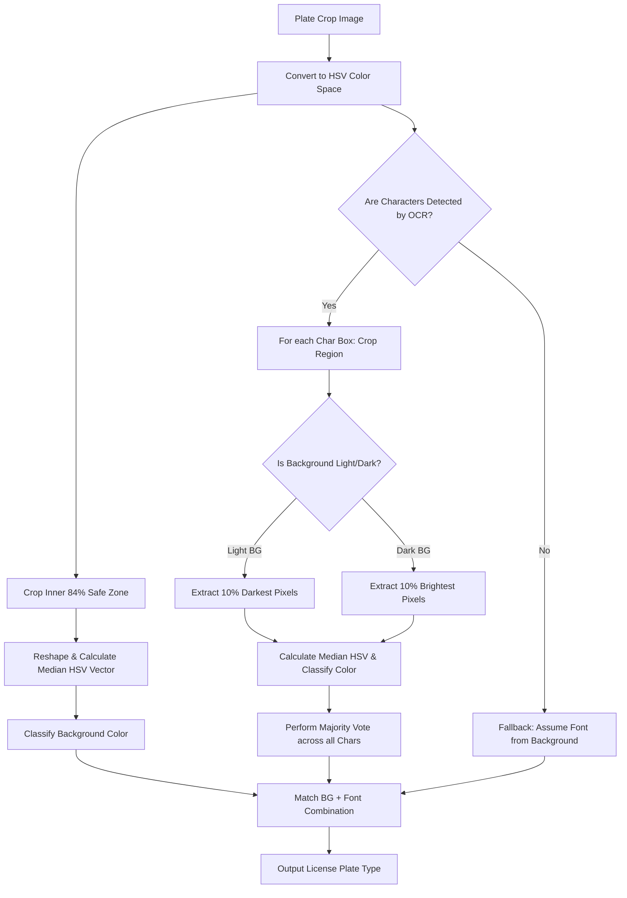

# Lao License Plate Type Extraction Logic

This document details the architecture, HSV color thresholds, segmentation heuristics, and decision matrix used to dynamically classify Lao license plates based on their background and font colors.

---

## 1. High-Level Flowchart

The system runs a dual-path analysis on the cropped license plate image to isolate the plate's background and character stroke colors, then combines them using Lao licensing rules:

---

## 2. Core Code Files

The logic is split between config definitions and extraction algorithms:
*   **HSV Boundaries & Voting Algorithm:** [color_utils.py](file:///c:/Users/billi/Desktop/laolicenceplate/AI/src/color_utils.py)
*   **Lao Plate Classification Rules:** [config.py](file:///c:/Users/billi/Desktop/laolicenceplate/AI/src/config.py#L81-L93)

---

## 3. Detailed Step-by-Step Logic

### Step 1: Background Color Extraction
1.  **Color Space Conversion:** The plate image is converted from BGR to **HSV (Hue, Saturation, Value)**. HSV separates color pigment (Hue) and intensity (Saturation) from lighting fluctuations (Value/Brightness), making the color classifier far more robust to sunlight, shadows, and camera exposure.
2.  **Inner Cropping (84% Safe Zone):**
    *   To avoid picking up plate brackets, frames, metal borders, or shadow cast at the edges of the plate, the system trims **8%** off the top, bottom, left, and right of the image.
    *   Formula for the crop bounding box:
        $$\text{Crop} = \text{Image}[0.08 \times H : 0.92 \times H, \; 0.08 \times W : 0.92 \times W]$$
3.  **Robust Median Vector:**
    *   The crop is flattened into a 1D pixel array.
    *   The system calculates the **median** value of the Hue, Saturation, and Value channels.
    *   > [!TIP]
        > The median is used instead of the mean because it is a robust estimator. Since characters (text) occupy less than 30% of the plate's area, the median successfully filters out the text color and isolates the background color without requiring complex masks.

---

### Step 2: Font / Letter Color Extraction
If characters are detected, the system inspects the stroke color inside each bounding box:
1.  **Character Box Crops:** For each character box returned by the OCR detector, a sub-crop is extracted.
2.  **Stroke Segmentation (10% Brightness Extremes):**
    *   Since text strokes are mixed with the background inside character boxes, we segment the strokes based on contrast:
        *   **Light Backgrounds (Yellow, White):** Text is dark. The pixels are sorted by Value ($V$) in ascending order. The **10% darkest pixels** are kept.
        *   **Dark Backgrounds (Blue, Red, Black):** Text is light. The pixels are sorted by Value ($V$) in descending order. The **10% brightest pixels** are kept.
3.  **Color Voting:**
    *   The median HSV of the segmented stroke pixels is classified into a color label.
    *   A majority vote (`Counter.most_common(1)`) across all character boxes determines the final font color.
4.  **OCR Failure Fallback:** If the OCR model fails to detect characters, the system defaults to background-dependent fallbacks (e.g. Yellow background assumes Black text).

---

## 4. HSV Color Classification Boundaries

The system classifies an arbitrary HSV coordinate $(H, S, V)$ into one of the key plate colors using the `classify_hsv_color(h, s, v)` function:

| Target Color | Hue ($H$) Range | Saturation ($S$) Range | Value ($V$) Range | Notes / Exceptions |
| :--- | :--- | :--- | :--- | :--- |
| **Black** | Any | Any | $V < 85$ | Represents dark colors/shadows. |
| **White / Grey** | Any | $S < 60$ | $V \ge 70$ | Low saturation, moderate/high brightness. |
| **Yellow** | $11 \le H \le 35$ | $S \ge 50$ | $V \ge 55$ | Typical warm yellow hues. |
| **Blue** | $90 \le H \le 145$ | $S \ge 40$ | $V \ge 110$ | High brightness blue. |
| **Dark Blue** | $90 \le H \le 145$ | $S \ge 40$ (or $S \ge 45$ if $V < 85$) | $50 \le V < 110$ | Shaded blue, common under vehicle shadows. |
| **Red** | $0 \le H \le 10$ or $160 \le H \le 180$ | $S \ge 40$ | $V \ge 50$ | Covers both lower and upper wrap of red hue. |

> [!IMPORTANT]
> **Dark Blue Shadow Exception:** 
> When state plates are in deep shadows, their brightness value ($V$) can drop below 85 (normally classified as Black). To counter this, a special rule checks if the Hue is in the blue range ($90 \le H \le 145$) and Saturation is high ($S \ge 45$); if so, it classifies it as **Dark Blue** instead of Black.

---

## 5. Lao License Plate Type Decision Matrix

After background and font colors are classified, they are mapped to the final license plate type:

| Background Color | Font / Text Color | Plate Type Classification | Target Audience |
| :--- | :--- | :--- | :--- |
| **Yellow** | **Black** | Private License Plate | General citizens, personal cars. |
| **White** | **Black** | Business License Plate (100%) | Commercial, freight, logistics. |
| **Blue / Dark Blue** | **White** | State License Plate | Government officials, state cars. |
| **White** | **Blue** | Business License Plate (1%) | Special business / joint venture imports. |
| **Red** | **White** | Public License Plate | Taxis, public buses, public transport. |
| **Yellow** | **Blue** | Foreign License Plate | Consular/Diplomatic or foreign organizations. |

### Fallback Mapping (Background Only)
In cases where no characters are detected:
*   `Yellow` ➔ **Private License Plate**
*   `White` ➔ **Business License Plate (100%)**
*   `Blue / Dark Blue` ➔ **State License Plate**
*   `Red` ➔ **Public License Plate**
*   `Black` ➔ **Business License Plate (1%)**

---

## 6. Tuning and Troubleshooting

If the model misclassifies plate types in specific environments, adjust the following:
*   **Shadows and low light:** If Yellow plates are classified as Black, lower the Black brightness threshold from $V < 85$ to $V < 70$ in `color_utils.py` (line 47).
*   **Dirty plates:** If dirty White plates are classified as Yellow, increase the minimum Yellow Saturation threshold from $S \ge 50$ to $S \ge 65$ (line 61).
*   **Safe Zone Crop adjustments:** If plates are tightly cropped by the detector, edge borders might bleed in. Adjust the 8% border variables (`border_y` / `border_x`) on lines 88-89 in `color_utils.py` to crop more or less aggressively.
