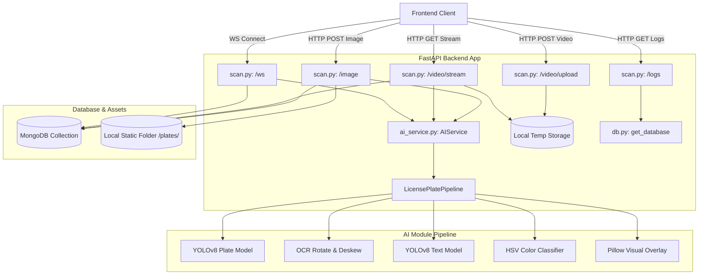

# Lao License Plate Backend Workflow & Technical Reference

This document provides a comprehensive overview of the backend codebase, architecture, API endpoints, data flow, and dependency mechanics designed for software engineers.

---

## Architecture Overview

The backend is a **FastAPI** Python application that integrates a custom **YOLOv8** computer vision pipeline, **MongoDB** for persistent detection logs, and real-time streaming interfaces (WebSockets and MJPEG video streaming).



---

## Directory Structure & Component Mapping

The backend files are structured as follows:

```
backend/
├── app/
│   ├── __init__.py
│   ├── config.py                 # Backend-specific settings & path loading
│   ├── db.py                     # MongoDB async database connection manager
│   ├── main.py                   # FastAPI main app lifecycle, CORS, & mounts
│   ├── routers/
│   │   └── scan.py               # Core API routes: Image, Video, WebSockets, & Logs
│   └── services/
│       └── ai_service.py         # Singleton wrapper to avoid re-instantiating YOLO
├── run.py                        # Uvicorn execution entrypoint
└── requirements.txt              # Backend package dependencies
```

### Key Modules:
- **[run.py](file:///c:/Users/billi/Desktop/laolicenceplate/backend/run.py)**: Configures and boots the Uvicorn ASGI server with hot reloading enabled.
- **[main.py](file:///c:/Users/billi/Desktop/laolicenceplate/backend/app/main.py)**: Configures the [FastAPI](file:///c:/Users/billi/Desktop/laolicenceplate/backend/app/main.py#L31) instance, initializes MongoDB and YOLO models asynchronously inside the [lifespan](file:///c:/Users/billi/Desktop/laolicenceplate/backend/app/main.py#L10) context manager, registers CORS middleware, mounts a local directory `/static` for file hosting, and loads routers.
- **[config.py](file:///c:/Users/billi/Desktop/laolicenceplate/backend/app/config.py)**: Holds environmental defaults for MongoDB and determines target absolute paths for integration with the parent **AI** module directory.
- **[db.py](file:///c:/Users/billi/Desktop/laolicenceplate/backend/app/db.py)**: Uses [motor.motor_asyncio.AsyncIOMotorClient](file:///c:/Users/billi/Desktop/laolicenceplate/backend/app/db.py#L1) to handle non-blocking asynchronous database operations.
- **[ai_service.py](file:///c:/Users/billi/Desktop/laolicenceplate/backend/app/services/ai_service.py)**: Modifies `sys.path` to dynamic link to the parent AI package. Implements a thread-safe singleton [AIService.get_pipeline](file:///c:/Users/billi/Desktop/laolicenceplate/backend/app/services/ai_service.py#L19) pattern so that the YOLOv8 model weights (.pt files) are loaded into memory or GPU exactly once.
- **[scan.py](file:///c:/Users/billi/Desktop/laolicenceplate/backend/app/routers/scan.py)**: The core logical controller defining route handlers and database persistence methods.

---

## Detailed Data Flows & API Endpoints

### 1. Single Image Analysis: `POST /api/v1/scan/image`
- **Purpose**: Processes a static uploaded image.
- **Request Format**: Multipart Form Data with file field `file`.
- **Flow**:
  1. The client uploads the image.
  2. The endpoint decodes image bytes using `cv2.imdecode`.
  3. The frame is evaluated through [LicensePlatePipeline.process_image](file:///c:/Users/billi/Desktop/laolicenceplate/AI/src/pipeline.py#L21) which:
     - Detects plate bounding box.
     - Runs deskew (rotations loop to find the sharpest OCR output).
     - Detects characters, reconstructs Lao and English text, groups them into lines, corrects characters based on contextual layout.
     - Extracts the background color and text color using HSV thresholds.
     - Draws a translucent visual overlay on the output image.
  4. The endpoint calls [log_detection_to_db](file:///c:/Users/billi/Desktop/laolicenceplate/backend/app/routers/scan.py#L28) which:
     - Saves the cropped license plate image locally in `static/plates/` using a unique MongoDB `ObjectId`.
     - Logs metadata (timestamp, plate style, colors, English/Lao OCR string, confidence score, relative static URL) to the `plate_logs` collection.
  5. Returns a JSON response containing detection metadata list and a base64-encoded JPEG representation of the annotated output image.

### 2. Video Upload & Async Streaming: `POST /api/v1/scan/video/upload` & `GET /api/v1/scan/video/stream`
- **Video Upload**:
  - **Purpose**: Stores an uploaded video file temporarily for downstream playback.
  - **Flow**: Saves the uploaded video buffer to the `backend/temp/` directory with a timestamped filename and returns the filename in JSON.
- **MJPEG Streaming Route**:
  - **Purpose**: Streams annotated video frames back to the client.
  - **Query Parameter**: `filename` (name of the temporary file).
  - **Flow**:
    1. Instantiates `cv2.VideoCapture` on the temporary path.
    2. Runs an asynchronous generator loop (`frame_generator`) that reads frames sequentially.
    3. Runs the AI pipeline on each frame.
    4. Automatically writes logs to MongoDB when plates are detected.
    5. Encodes annotated frames to JPEG, formats them as standard HTTP `multipart/x-mixed-replace` boundaries, and yields the stream chunks at a controlled framerate (~30 FPS).
    6. **Cleanup**: Automatically closes `cv2.VideoCapture` and deletes the temporary video file from disk once the client terminates the connection or the stream reaches its end.

### 3. Real-Time Camera WebSocket: `WS /api/v1/scan/ws`
- **Purpose**: Low-latency duplex stream for continuous canvas drawing (e.g., live webcam).
- **Flow**:
  1. Connection is upgraded to WebSocket protocol.
  2. Client continuously streams raw binary image frames.
  3. The server decodes frame bytes, processes them via the AI pipeline, logs detected plates to the database, and converts annotated frames to base64 JPEGs.
  4. Sends a JSON packet back to the client containing detection arrays and the base64-encoded frame.
  5. Gracefully handles client disconnects and internal exceptions without interrupting the FastAPI listener.

### 4. History Logs Retrieval: `GET /api/v1/scan/logs`
- **Purpose**: Lists previously scanned plates.
- **Query Parameter**: `limit` (Defaults to 50 records, capped at 500 max).
- **Flow**:
  - Queries MongoDB `plate_logs` database collection sorted by `timestamp` in descending order.
  - **Performance Optimization**: Projects only `_id`, `ocr_lao`, `plate_type`, and `image_url` fields, leaving out heavier fields unless explicitly needed.

---

## AI Pipeline Integration Mechanics

```
                  ┌──────────────────────────────┐
                  │   ai_service.py Singleton    │
                  └──────────────┬───────────────┘
                                 │
                                 ▼
                  ┌──────────────────────────────┐
                  │  LicensePlatePipeline (AI/)   │
                  └──────────────┬───────────────┘
                                 │
            ┌────────────────────┼────────────────────┐
            ▼                    ▼                    ▼
   ┌─────────────────┐  ┌─────────────────┐  ┌─────────────────┐
   │  OCR Utilities  │  │ Color Utilities │  │Visual Utilities │
   └─────────────────┘  └─────────────────┘  └─────────────────┘
```

The FastAPI application decouples routing and web-sockets from heavy calculations by outsourcing the inference to the [LicensePlatePipeline](file:///c:/Users/billi/Desktop/laolicenceplate/AI/src/pipeline.py#L9) module. 

> [!NOTE]
> ### System Warm-Up
> To prevent cold-start latencies where the first API call stalls waiting for machine learning models to load, the backend pre-warms YOLOv8 models during the application's lifespan start event (see `app/main.py`).

### Pipeline Execution Order:
1. **Stage 1 (Plate Bounding Box)**: Runs vehicle plate YOLOv8 model. Uses adaptive thresholds (first tries `PLATE_CONF_HIGH=0.18`, falls back to `PLATE_CONF_LOW=0.10` if empty) to detect plate contours.
2. **Stage 2 (Deskewing)**: The cropped plate undergoes rotation tests (testing `[-10, -5, 0, 5, 10]` degrees) to optimize character bounding box scores.
3. **Stage 3 (Character Detection)**: Runs character recognition YOLOv8 model.
4. **Stage 4 (Heuristics & Text Correction)**:
   - Non-Maximum Suppression (NMS) checks overlap.
   - Text is split into lines and sorted horizontally.
   - Character replacement filters resolve lookalikes (e.g., `O` vs `0`, `I` vs `1`) depending on position in the plate layout (e.g., the last 4 characters are numeric digits).
   - Province abbreviation mapping translates symbols to fully expanded English and Lao scripts.
5. **Stage 5 (HSV Classification)**: Median color extraction determines background and text color to categorize the plate type (e.g., private, state, business).
6. **Stage 6 (Overlay Generation)**: PIL text render draws Lao characters and custom metadata overlay onto the final image frame.

---

## Setup & Execution

### Prerequisites:
- Python 3.8+
- Active MongoDB instance running on `mongodb://localhost:27017`

### Execution:

1. **Setup Python Virtual Environment**:
   ```powershell
   python -m venv .venv
   .venv\Scripts\Activate.ps1
   pip install -r requirements.txt
   ```

2. **Boot the Backend Server**:
   ```powershell
   python run.py
   ```
   The service will boot by default on `http://0.0.0.0:8000` with Swagger UI documentation available at `http://localhost:8000/docs`.
