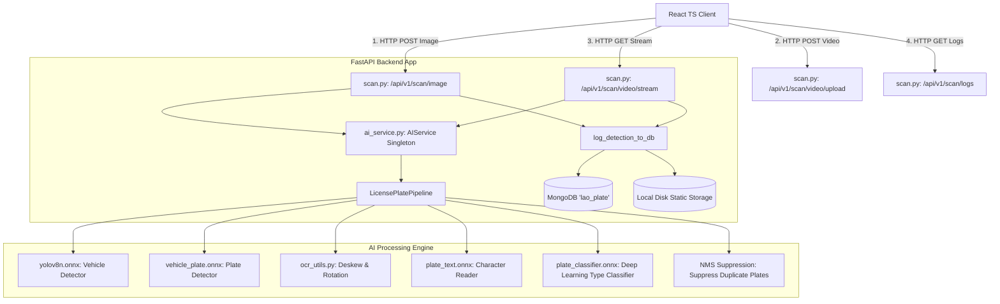
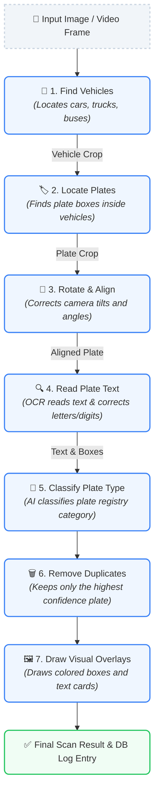

# Lao License Plate Recognition System: Architecture & Workflow Guide

This document describes the high-level system architecture, database schema, component boundaries, and step-by-step logical workflow of the application. It is designed to help new developers understand the codebase and integration flows quickly.

---

## 1. System Architecture Overview

The system is split into three main layers: **React Frontend**, **FastAPI Backend**, and the **AI Processing Pipeline** running ONNX models with GPU (DirectML) acceleration. Detections and audit images are persisted in **MongoDB** and local static directories.



---

## 2. Step-by-Step AI Core Detection Logic

When an image is sent to the AI engine, it processes the image in **7 simple steps** to read the license plate and identify its type:



### 1. Find the Vehicles 🚗
*   **What it does:** The system scans the full image to locate cars, buses, and trucks.
*   **Why we do it:** To avoid mistakes. Fences, signs, and background objects can look like license plates. By first locating the vehicle, we ensure we only look for plates in valid areas.

### 2. Locate the License Plates 🏷️
*   **What it does:** For every vehicle found in Step 1, the AI zooms in and scans for a license plate inside that specific vehicle's bounding box.
*   **Why we do it:** Scanning a small vehicle crop is much faster and more accurate than searching the entire high-resolution image. If no vehicles are found, it scans the full image as a fallback.

### 3. Rotate & Align the Plate (Deskewing) 🔄
*   **What it does:** If the camera is tilted, the system rotates the plate crop slightly (trying various angles from $-10^\circ$ to $+10^\circ$) to find the straightest orientation.
*   **Why we do it:** A straight, flat plate is much easier for the OCR text reader to read accurately than a tilted or skewed one.

### 4. Read the Plate Text (OCR) 🔍
*   **What it does:** The AI analyzes the characters on the straight plate image, groups them into lines, and decodes them into text.
*   **Why we do it:** To extract the letters and numbers. It also applies correction rules (like converting the letter `O` to a number `0` when inside a digit sequence) and translates abbreviations like `VTE` to full province names (e.g. `ນະຄອນຫຼວງວຽງຈັນ (Vientiane)`).

### 5. Classify the Plate Registry Type (AI Classifier) 🎨
*   **What it does:** A trained classification model inspects the plate crop to identify if it is a Private, State, Public, Business, or Foreign plate.
*   **Why we do it:** It replaces unstable manual color check rules with a robust deep learning classifier (`plate_classifier.onnx`) that isn't fooled by shadows, dirt, or license plate frames.

### 6. Remove Duplicate Detections (Clean Up) 🗑️
*   **What it does:** If the AI detects the same license plate multiple times (with slightly overlapping boxes), it filters them out and keeps only the single best, highest-confidence box.
*   **Why we do it:** To prevent logging the same license plate twice in the database from a single scan.

### 7. Draw Visual Overlays 🖼️
*   **What it does:** Translates coordinates back to the original image size and draws green boxes around vehicles, colored boxes around plates (Yellow, Blue, Red, or White), and text overlays.
*   **Why we do it:** To show the user exactly where the detections occurred in the visual frontend interface.

---

## 3. Data Flow & Integration (AI ➔ Backend ➔ DB ➔ Frontend)

### Phase 1: Upload & Inference (Static Scan)
1.  **Frontend Upload:** The user selects an image and clicks **Scan License Plate** in the React app. The client issues a `multipart/form-data` HTTP POST request containing the image file to the backend: `/api/v1/scan/image`.
2.  **API Handler:** The backend router [scan.py](file:///c:/Users/billi/Desktop/laolicenceplate/backend/app/routers/scan.py) decodes the image bytes into an OpenCV BGR numpy array (`cv2.imdecode`) and calls the singleton `AIService` pipeline: `pipeline.process_image(img)`.
3.  **Inference:** The AI pipeline runs vehicle and plate detection (using DirectML GPU acceleration), performs OCR, applies the deep learning classifier model to determine plate style and properties, draws the visual overlays, and returns:
    *   An array of detection dictionaries (containing coordinates, cropped images, text values, and colors).
    *   The fully annotated output image.

### Phase 2: Logging & Persistence
4.  **Local Storage:** The backend extracts the cropped license plate and vehicle numpy arrays out of the results array. It saves them locally to their respective static directories:
    *   `backend/static/plates/{id}.jpg`
    *   `backend/static/vehicles/{id}.jpg`
5.  **Database Storage:** A new document is written to the MongoDB `plate_logs` collection. The relative access URLs (e.g. `/static/vehicles/{id}.jpg`) are recorded alongside the OCR text, confidence scores, and plate type.
6.  **Response:** The API server converts the annotated image into a base64 string and sends the final JSON payload containing the metadata list and base64 image back to the frontend.

### Phase 3: Frontend Render
7.  **Scan Render:** The frontend UI renders the full annotated image alongside a detailed list. For each plate found, it shows the OCR values, plate type, and displays side-by-side cropped images of the vehicle and license plate.
8.  **Database History Render:** When a user navigates to the **Plate Database** tab, the frontend requests `GET /api/v1/scan/logs`. The backend returns the latest records from MongoDB, and the frontend dynamically displays them in dashboard cards showing both the vehicle and plate crops.

### Phase 4: Video Upload & Real-Time Stream
1.  **Video Upload:** When a user uploads a video file in the React frontend, it calls `POST /api/v1/scan/video/upload` to store the raw video temporarily in the backend's `backend/temp/` folder.
2.  **Streaming Loop:** The client renders an `` tag with the source pointing to `/api/v1/scan/video/stream?filename={temp_filename}`.
3.  **Frame-by-Frame Inference:** The backend initiates an MJPEG stream (`multipart/x-mixed-replace`). It reads frames from the video file sequentially, runs the `LicensePlatePipeline` on each frame, logs any newly detected plates to MongoDB/local directories, encodes the annotated frame as JPEG, and streams it back at approximately 30 FPS.
4.  **Automatic Cleanup:** Once the video ends or the user stops the stream, the backend automatically releases the OpenCV VideoCapture object and deletes the temporary upload file from disk.

---

## 4. Database Schema (MongoDB `plate_logs`)

Each logged license plate record in MongoDB follows this structured schema:

```json
{
  "_id": ObjectId("6a32d385b736b71dd10aa4b3"),
  "timestamp": 1781883845.123,
  "ocr_en": "VTE | A R 0 0 9 3",
  "ocr_lao": "ນະຄອນຫຼວງວຽງຈັນ (Vientiane) | ກ ພ 0 0 9 3",
  "bg_color": "Yellow",
  "font_color": "Black",
  "plate_type": "Private License Plate",
  "confidence": 0.88,
  "image_url": "/static/plates/6a32d385b736b71dd10aa4b3.jpg",
  "vehicle_image_url": "/static/vehicles/6a32d385b736b71dd10aa4b3.jpg"
}
```

---

## 5. Summary of Main Code Files

*   **[main.py (AI)](file:///c:/Users/billi/Desktop/laolicenceplate/AI/main.py):** CLI script to process local files in `test_images/`.
*   **[pipeline.py (AI)](file:///c:/Users/billi/Desktop/laolicenceplate/AI/src/pipeline.py):** The master orchestration pipeline containing hierarchical logic and the duplicate plate NMS filter.
*   **[ocr_utils.py (AI)](file:///c:/Users/billi/Desktop/laolicenceplate/AI/src/ocr_utils.py):** Logic for deskewing/rotation, character correction, line grouping, and province matching.
*   **[scan.py (Backend)](file:///c:/Users/billi/Desktop/laolicenceplate/backend/app/routers/scan.py):** API routes for static scans (`/image`), history logs (`/logs`), and video streams (`/video/upload`, `/video/stream`).
*   **[ImageScanner.tsx (Frontend)](file:///c:/Users/billi/Desktop/laolicenceplate/frontend/src/components/ImageScanner.tsx):** Web page displaying upload boxes and side-by-side crop scans.
*   **[PlateDatabase.tsx (Frontend)](file:///c:/Users/billi/Desktop/laolicenceplate/frontend/src/components/PlateDatabase.tsx):** History dashboard showing recent scans.
