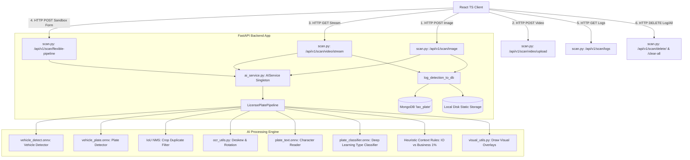
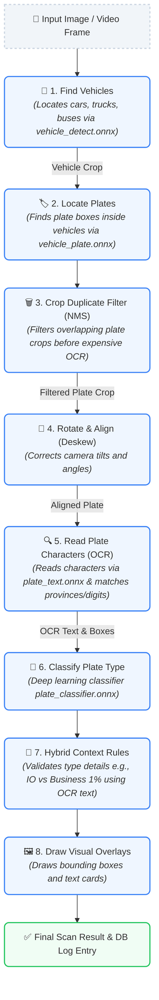

# Lao License Plate Recognition System: Architecture & Workflow Guide

This document describes the high-level system architecture, database schema, component boundaries, and step-by-step logical workflow of the application. It is updated to reflect the transition from HSV color logic heuristics to a deep learning classification pipeline, dynamic tracking and update logic, the Sandbox architecture, and the standalone `new-redesign` testing sandbox.

---

## 1. System Architecture Overview

The system is split into three main layers: **React Frontend**, **FastAPI Backend**, and the **AI Processing Engine** running ONNX models with GPU (DirectML/CUDA) or CPU execution providers. Detections and audit images are persisted in **MongoDB** and local static directories.



---

## 2. Step-by-Step AI Core Detection Logic

When an image is sent to the AI engine, it processes the image in **8 logical steps** to locate vehicles, read license plates, and identify registry categories:



### 1. Find the Vehicles 🚗
*   **What it does:** Scans the full image using `vehicle_detect.onnx` to locate cars, buses, and trucks (COCO classes `2`, `5`, `7`).
*   **Why we do it:** To limit false positives. Standard background noise (e.g. billboards, fences) can resemble license plates. Locating the vehicle first restricts plate searches to valid vehicle contexts.

### 2. Locate the License Plates 🏷️
*   **What it does:** Runs `vehicle_plate.onnx` on each vehicle bounding box crop. If no vehicles are found, the pipeline scans the entire image as a fallback.
*   **Why we do it:** Localizing the search inside a crop is faster and yields higher resolution boundaries for tilted or distant plates.

### 3. Crop Duplicate Filter (NMS) 🗑️
*   **What it does:** Evaluates candidate plate bounding boxes using a custom **Intersection over Union (IoU) Non-Maximum Suppression** filter (suppresses boxes with IoU $> 0.4$).
*   **Why we do it:** Prevents double-processing and double-logging when multiple overlapping boxes are generated for the same physical plate.

### 4. Rotate & Align the Plate (Deskewing) 🔄
*   **What it does:** Iterates through a set of candidate rotation angles (`0`, `-5`, `5`, `-10`, `10` degrees) and feeds the rotated crop to the OCR model. The angle yielding the highest confidence score is selected.
*   **Why we do it:** Tilted cameras introduce reading errors. Straightening the characters beforehand significantly improves OCR accuracy.

### 5. Read Plate Characters (OCR) 🔍
*   **What it does:** Runs `plate_text.onnx` on the straightened plate crop, translates predicted character classes to Lao script characters, groups characters into lines, and corrects logical lookalikes (e.g., swapping `O` and `0` contextually). Abbreviated English provinces (e.g., `VTE`) are matched to full Lao descriptions.

### 6. Classify Plate Registry Type 🎨
*   **What it does:** Runs the deep learning model `plate_classifier.onnx` (trained as a YOLOv8-classify model) to output a probability vector across registry styles.
*   **Why we do it:** Former HSV-based color rules were sensitive to exposure, dirt, glare, and shadow. Deep learning classifiers look at global visual texture and color distributions, boosting robustness.

### 7. Hybrid Context Rules 🧩
*   **What it does:** Refines predictions using OCR context. For example, both **Business 1%** and **International Organization** plates have white backgrounds with blue text. The system checks character boxes for Lao province text: if present, it is mapped to **Business 1%**; if absent, it is mapped to **International Organization** (which do not have province indicators).

### 8. Draw Visual Overlays 🖼️
*   **What it does:** Scales coordinates back to original image boundaries and overlays vehicle bounding boxes (green), plate bounding boxes (color-coded by type), and text result cards.

---

## 3. Data Flow & Integration (AI ➔ Backend ➔ DB ➔ Frontend)

### Phase 1: Upload & Inference (Static Scan)
1.  **Frontend Upload:** The user uploads an image under the **Scan Image** tab. The client posts the file payload to `POST /api/v1/scan/image`.
2.  **API Handler:** The backend router [scan.py](file:///c:/Users/billi/Desktop/laolicenceplates/code/backend/app/routers/scan.py) decodes the image bytes and passes the image array to the singleton `AIService` pipeline.
3.  **Inference:** The AI pipeline executes the detection cascade using DirectML/CUDA GPU acceleration, writes the annotated visual overlays, and returns a JSON payload containing base64 output representations and metadata.

### Phase 2: Logging & Persistence
4.  **Local Storage:** The backend extracts the cropped license plate and vehicle arrays, saving them as JPG files locally in the static folders:
    *   `backend/static/plates/{id}.jpg`
    *   `backend/static/vehicles/{id}.jpg`
5.  **Database Storage:** The scan metadata, colors, confidence scores, and relative URLs are saved to the MongoDB `plate_logs` collection.

### Phase 3: Video Upload & Real-Time Tracking
1.  **Video Upload:** Pre-recorded videos are uploaded via `POST /api/v1/scan/video/upload` and stored in `backend/temp/`.
2.  **Streaming Loop:** The frontend requests `GET /api/v1/scan/video/stream?filename={temp_filename}` within an `` element. The backend streams frames as an MJPEG block (`multipart/x-mixed-replace`) at ~30 FPS.
3.  **Sequential Match De-duplication:** To prevent multiple duplicate database logs from a continuous video stream, the backend maintains a sliding cache (`RECENT_DETECTIONS`). If a plate matches an existing record (by OCR similarity or spatial box overlap `IoU > 0.4`):
    *   If the new frame has a **higher confidence score**, the existing MongoDB document is updated with the new cropped images and metadata.
    *   Otherwise, the frame is annotated and streamed, but duplicate logging is suppressed.

### Phase 4: Model Sandbox (Step-by-Step Testing)
1.  **Tab Interface:** The **Model Sandbox** tab lets developers upload images and toggle pipeline components (Vehicle, Plate, OCR, Classifier) individually.
2.  **Stateless Endpoint:** The frontend calls `POST /api/v1/scan/flexible-pipeline`, which processes the toggled steps dynamically and returns bounding boxes and badges **without writing logs to MongoDB or saving files to disk**.

---

## 4. Database Schema (MongoDB `plate_logs`)

Each logged record in the database follows this structure:

```json
{
  "_id": ObjectId("6a32d385b736b71dd10aa4b3"),
  "timestamp": 1781883845.123,
  "ocr_en": "VTE | A R 0 0 9 3",
  "ocr_lao": "ນະຄອນຫຼວງວຽງຈັນ (Vientiane) | ກ ພ 0 0 9 3",
  "bg_color": "Yellow",
  "font_color": "Black",
  "plate_type": "Private License Plate (Yellow bg, Black text)",
  "confidence": 0.88,
  "image_url": "/static/plates/6a32d385b736b71dd10aa4b3.jpg",
  "vehicle_image_url": "/static/vehicles/6a32d385b736b71dd10aa4b3.jpg"
}
```

---

## 5. Standalone Model Validation Sandbox (`new-redesign/`)

Located in `/new-redesign`, this subdirectory contains an isolated model testing application.
*   **Purpose:** Decouples inference code from database environments, enabling fast verification of individual model parameters and weights.
*   **No DB Dependency:** Operates completely without MongoDB or file writes, hosting its own lightweight React client and Uvicorn FastAPI server on port `8001`.

---

## 6. Summary of Main Code Files

*   **[pipeline.py (AI)](file:///c:/Users/billi/Desktop/laolicenceplates/code/AI/src/pipeline.py):** Master orchestration pipeline containing the cascade inference structure and IoU NMS filter.
*   **[ocr_utils.py (AI)](file:///c:/Users/billi/Desktop/laolicenceplates/code/AI/src/ocr_utils.py):** Deskewing, rotation processing, line grouping, province matching, and character lookalike corrections.
*   **[scan.py (Backend)](file:///c:/Users/billi/Desktop/laolicenceplates/code/backend/app/routers/scan.py):** Router containing endpoints for static scans (`/image`), history logs (`/logs`), delete and purge routes (`/delete/{log_id}`, `/clear-all`), and the stateless sandbox `/flexible-pipeline`.
*   **[ModelSandbox.tsx (Frontend)](file:///c:/Users/billi/Desktop/laolicenceplates/code/frontend/src/components/ModelSandbox.tsx):** Interactive dashboard interfacing with the backend's flexible sandbox route.
*   **[VideoScanner.tsx (Frontend)](file:///c:/Users/billi/Desktop/laolicenceplates/code/frontend/src/components/VideoScanner.tsx):** Dashboard for video uploads and processed MJPEG stream display.
*   **[color_utils.py (AI) [DEPRECATED]](file:///c:/Users/billi/Desktop/laolicenceplates/code/AI/src/color_utils.py):** Former HSV color segmentation scripts, now deprecated following the integration of the deep learning classifier.
